# Quiz Moa API Server

## 프로젝트 소개

- [프로젝트 소개 페이지 링크](https://leesh5000.notion.site/Quiz-Moa-2df85502f59b4d019b98ed0e08f42919)

## 사용 기술

- 언어 : Java 17
- 빌드 도구 : Gradle 7.5.1
- 프레임워크 : Spring Boot 3.0.1
- 공통 : Spring Validation, Spring AOP, Lombok
- 유저 인증 : [JJWT](https://mvnrepository.com/artifact/io.jsonwebtoken/jjwt)
- 테스트도구 : Junit5, Mockito
- DB : H2 Database (테스트용), MariaDB (운영)
- DB 접근 기술 : Spring Data JPA + QueryDSL, Mybatis
- 프로퍼티 암호화 : [Jasypt](https://github.com/ulisesbocchio/jasypt-spring-boot)
- API 문서 : Spring Rest Docs
- oauth2 클라이언트 : Spring Cloud OpenFeign

## 유즈케이스

- 이슈 링크 : [#4](https://github.com/leesh5000/quiz-app-be/issues/4)



## ERD

- 이슈 링크 : [#6](https://github.com/leesh5000/quiz-app-be/issues/6)


### SQL

```mysql
create table users
(
    id                       bigint auto_increment,
    username                 varchar(30)  not null,
    email                    varchar(255) not null unique,
    password                 varchar(255),
    deleted                  boolean      not null   default false,
    role                     varchar(10)  not null,
    oauth2_type              varchar(10)  not null,
    profile                  varchar(255),
    refresh_token            varchar(255),
    refresh_token_expires_in datetime,
    created_by               varchar(255) not null,
    modified_by              varchar(255) not null,
    created_at               timestamp    not null,
    modified_at              timestamp    not null,
    primary key (id)
) default character set utf8mb4 collate utf8mb4_general_ci;

create index users_username_idx on users (username);
create index users_email_idx on users (email);
create index users_created_at_idx on users (created_at);

create table quiz
(
    id          bigint auto_increment,
    user_id     bigint       not null,
    title       varchar(255) not null,
    contents    text         not null,
    deleted     boolean      not null   default false,
    created_by  varchar(255) not null,
    modified_by varchar(255) not null,
    created_at  timestamp    not null,
    modified_at timestamp    not null,
    primary key (id),
    foreign key (user_id) references users (id)
) default character set utf8mb4 collate utf8mb4_general_ci;

create index quiz_title_idx on quiz (title);
create index quiz_created_at_idx on quiz (created_at);
create index quiz_user_id_idx on quiz (user_id);

create table answer
(
    id          bigint auto_increment,
    user_id     bigint       not null,
    quiz_id     bigint       not null,
    contents    text         not null,
    deleted     boolean      not null   default false,
    created_by  varchar(255) not null,
    modified_by varchar(255) not null,
    created_at  timestamp    not null,
    modified_at timestamp    not null,
    primary key (id),
    foreign key (user_id) references users (id),
    foreign key (quiz_id) references quiz (id)
) default character set utf8mb4 collate utf8mb4_general_ci;

create index answer_created_at_idx on answer (created_at);
create index answer_user_id_idx on answer (user_id);
create index answer_quiz_id_idx on answer (quiz_id);

create table answer_vote
(
    id          bigint auto_increment,
    user_id     bigint       not null,
    answer_id   bigint       null,
    value       tinyint      not null,
    created_by  varchar(255) not null,
    modified_by varchar(255) not null,
    created_at  timestamp    not null,
    modified_at timestamp    not null,
    primary key (id),
    foreign key (user_id) references users (id),
    foreign key (answer_id) references answer (id)
) default character set utf8mb4 collate utf8mb4_general_ci;

create index answer_vote_user_id_idx on answer_vote (user_id);
create index answer_vote_answer_id_idx on answer_vote (answer_id);

create table quiz_vote
(
    id          bigint auto_increment,
    user_id     bigint       not null,
    quiz_id     bigint       null,
    value       tinyint      not null,
    created_by  varchar(255) not null,
    modified_by varchar(255) not null,
    created_at  timestamp    not null,
    modified_at timestamp    not null,
    primary key (id),
    foreign key (user_id) references users (id),
    foreign key (quiz_id) references quiz (id)
) default character set utf8mb4 collate utf8mb4_general_ci;

create index answer_vote_user_id_idx on quiz_vote (user_id);
create index answer_vote_quiz_id_idx on quiz_vote (quiz_id);
```

## API 명세서

- 이슈 링크 : [#88](https://github.com/leesh5000/quiz-app-be/issues/88)
- API Docs 링크 : https://quiz-moa-api.com/docs/api-docs.html
  - Public API가 아니므로, 추후 비공개로 전환할 예정입니다.

## 시스템 아키텍처 & CI/CD 파이프라인
